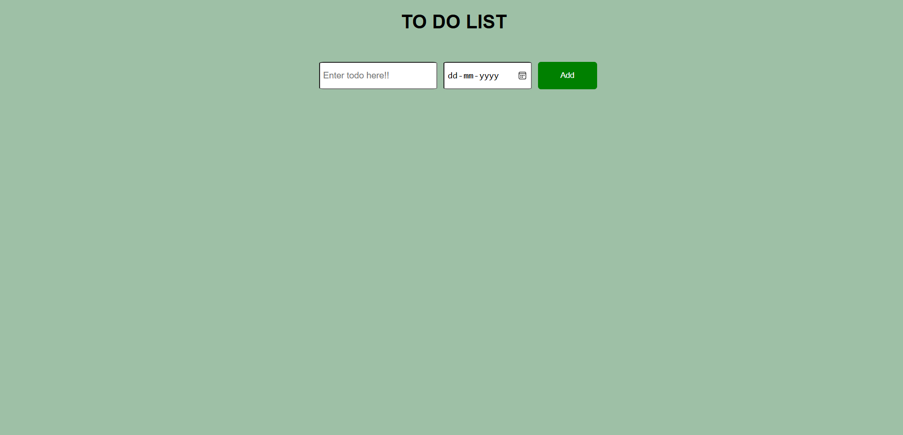

# ✅ To Do List 

A simple and responsive **To-Do List** web app built using **HTML**, **CSS**, and **JavaScript**.  
Helps users add, manage, and remove daily tasks efficiently.

---

## 📌 Features

- ✅ Add new tasks
- ✅ Mark tasks as completed
- ✅ Delete individual tasks
- ✅ Automatically updates UI in real-time
- ✅ Clean and user-friendly interface

---

## 🛠️ Technologies Used

- **HTML** – Markup and structure  
- **CSS** – Styling and layout  
- **JavaScript (todo.js)** – App logic and interactivity

---

## 📂 Project Structure

to-do-list/
├── index.html # Main HTML structure
├── style.css # Styles for the app
├── todo.js # JavaScript logic
├── screenshot.png # App screenshot
├── LICENSE # License file
└── README.md # Project documentation

---

## 📸 Screenshot

---

## 🚀 Live Demo

Try it here: (https://prashant-pal23.github.io/todo-list/)

> Replace `Prashant-Pal23` with your actual GitHub username.

---

📄 License

This project is licensed under the MIT License.

---

✨ Author

Prashant Pal